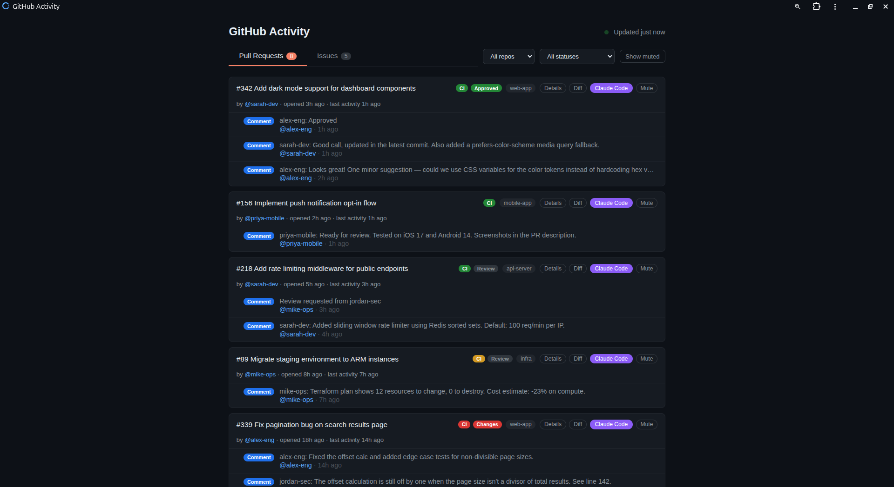
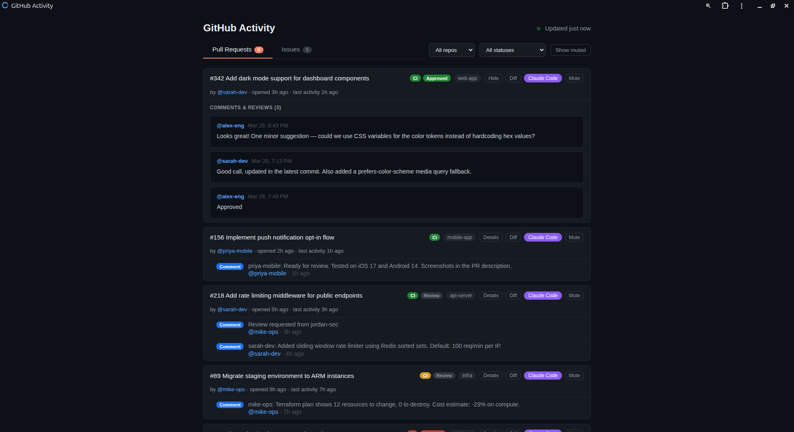
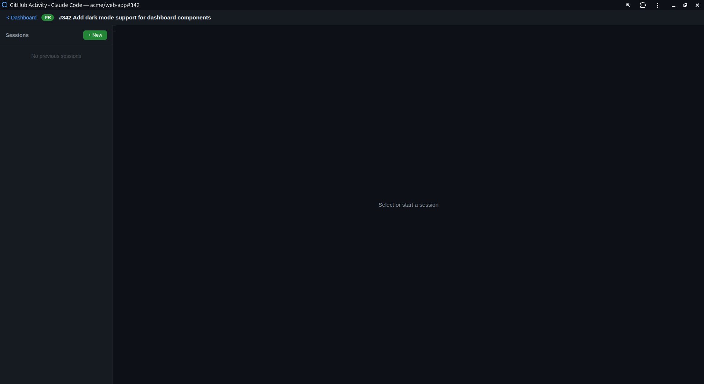

# GitHub Activity Dashboard

A self-hosted PWA that monitors GitHub PR/issue activity across multiple repos, sends desktop notifications, and provides an integrated Claude Code terminal for interactive AI-assisted code review.







## Features

- **PR & Issue Tracking** — All open PRs and issues across watched repos, sorted by recent activity
- **Activity Feed** — Comments, reviews, commits shown under each item with correct timestamps
- **Desktop Notifications** — Native alerts for new PRs, issues, and comments (Linux + macOS)
- **Browser Notifications** — PWA push notifications with click-to-open
- **CI & Review Status** — Green/red/yellow CI badges, review decision badges, draft indicators
- **Inline Diff Viewer** — View PR diffs without leaving the dashboard
- **Detail Viewer** — Expand any item to see the full description, comments, and reviews rendered as markdown
- **Mute/Archive** — Hide noisy items, toggle visibility
- **Filters** — Filter by repo, review status (needs review, approved, changes requested, draft)
- **Claude Code Terminal** — Launch an interactive Claude Code session scoped to any PR or issue
- **Session History** — View and resume past Claude Code sessions per repo/PR

## Setup

### Prerequisites

- Python 3.10+
- [GitHub CLI](https://cli.github.com/) (`gh`) authenticated
- [Claude Code CLI](https://docs.anthropic.com/en/docs/claude-code) (`claude`) installed
- Linux or macOS

### Quick Install

```bash
curl -fsSL https://raw.githubusercontent.com/hraju115/gh-codepilot/main/install.sh | bash
```

This will:
- Clone the repo to `~/.gh-codepilot`
- Create a Python venv and install dependencies
- Set up a cron job for polling (every 10 minutes)
- Start a background service (systemd on Linux, launchd on macOS)

Then edit `~/.gh-codepilot/repos.conf` to add your repos and visit **http://127.0.0.1:5050**.

### Manual Install

```bash
git clone https://github.com/hraju115/gh-codepilot.git
cd gh-codepilot
python3 -m venv .venv && source .venv/bin/activate
pip install -r requirements.txt
cp repos.conf.example repos.conf
# Edit repos.conf — add your repos, one per line
python app.py
```

### Install as PWA

Open `http://127.0.0.1:5050` in Chrome/Edge and click the install icon in the address bar.

### Uninstall

```bash
curl -fsSL https://raw.githubusercontent.com/hraju115/gh-codepilot/main/uninstall.sh | bash
```

## Architecture

```
check_notifications.py (cron, every 10min)
  ├─ gh pr/issue list     → open_items.json (all open PRs/issues)
  ├─ /repos/{repo}/events → events.jsonl (activity log)
  └─ notify-send          → desktop notifications

app.py (Flask + SocketIO, port 5050)
  ├─ GET /                → dashboard (index.html)
  ├─ GET /api/events      → polling endpoint
  ├─ GET /api/detail      → PR/issue body + comments
  ├─ GET /api/diff        → PR diff
  ├─ GET /api/sessions    → Claude Code session history
  ├─ POST /api/mute       → mute an item
  ├─ GET /terminal        → Claude Code terminal page
  └─ WebSocket            → PTY I/O for Claude Code
```

## Files

| File | Purpose |
|------|---------|
| `app.py` | Flask web app with SocketIO |
| `check_notifications.py` | Cron script — polls GitHub, sends notifications |
| `repo_manager.py` | Git clone/fetch/worktree management |
| `session_reader.py` | Reads Claude Code session history |
| `pty_manager.py` | PTY lifecycle for Claude Code terminals |
| `repos.conf` | List of repos to watch |
| `templates/index.html` | Dashboard UI |
| `templates/terminal.html` | Claude Code terminal page |
| `static/` | PWA manifest, service worker, icons |
